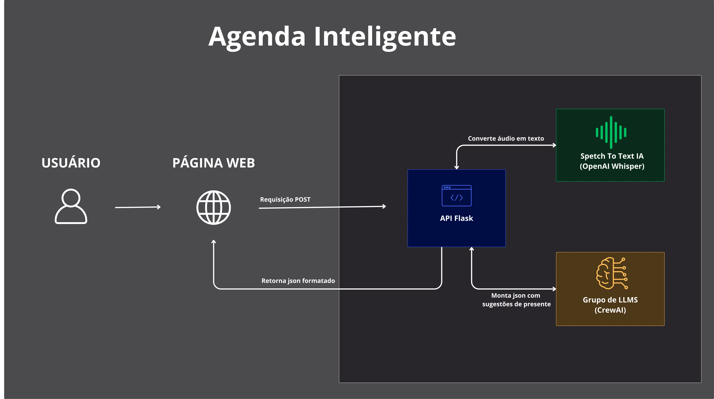

# Agenda inteligente

<p>Projeto em fase de viabilização.</p>
<p>Funcionalidades do sistema:</p>

- Atualmente esse projeto é capaz de receber um áudio, e converter o áudio em texto,
- Verificar se ele se trata de uma solicitação de agendamento de aniversário,
- Elaborar sugestões de presente de acordo com as características do aniversariante,
- Estruturar esse texto em um json bem organizado com as sugestões de presente,
- Exibir o json final ao usuário.

---

## Fluxo da Aplicação



---

## Instalação

Certifique-se de ter o docker e docker compose instalados corretamente em sua máquina.

Execute o comando:
```
docker compose up
````

## Links do Projeto

* **Frontend:** [http://localhost](http://localhost)
* **Backend:** [http://localhost:5000](http://localhost:5000)

### Observação: 

O projeto demora muito para buildar e iniciar na primeira execução. </br>
As próximas execuções são menos demoradas.
